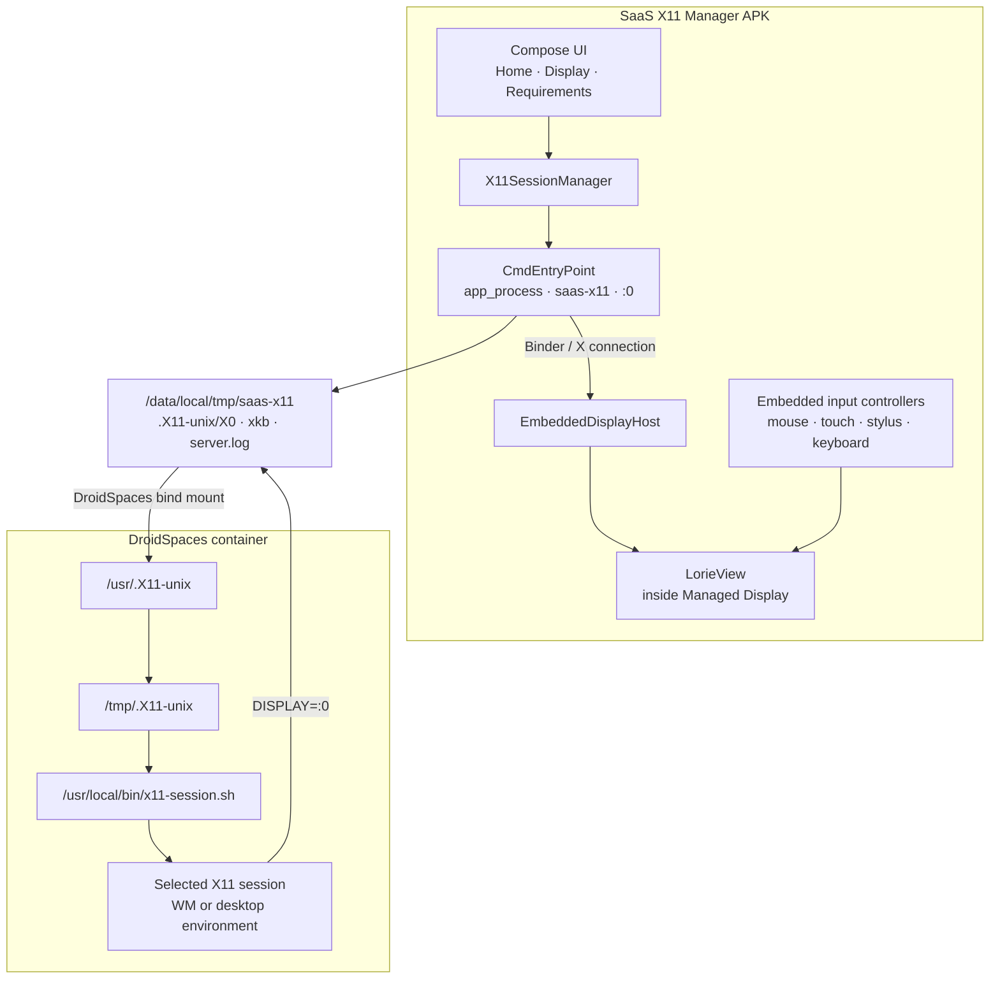

# SaaS X11 Manager

<p align="center">
  <strong>A rooted Android control plane for DroidSpaces graphical sessions, with Termux:X11/Lorie compiled directly into the Manager.</strong>
</p>

<p align="center">
  <a href="https://github.com/SaaSD3v/SaaS-X11-Manager/actions/workflows/ci.yml"></a>
  <a href="https://github.com/SaaSD3v/SaaS-X11-Manager/actions/workflows/rootfs-compatibility.yml"></a>
</p>

SaaS X11 Manager manages DroidSpaces containers and their X11 graphical sessions from one Android application. The X server is not handed off to a separate Termux:X11 application: the Manager builds the pinned Termux:X11/Lorie engine into its own APK, starts the server through its own APK classpath, renders `LorieView` inside the Manager UI, and connects DroidSpaces containers to the Manager-owned X11 socket.

The central design rule is simple:

> **Detect capabilities at runtime. Do not select behavior from a hardcoded DroidSpaces, kernel, distro, or package version.**

The active integrated-X11 development branch is **`agent/integrated-x11`**.

---

## Contents

- [What the project does](#what-the-project-does)
- [Architecture](#architecture)
- [Integrated X11 runtime](#integrated-x11-runtime)
- [What happens when Start X11 is pressed](#what-happens-when-start-x11-is-pressed)
- [Display workspace](#display-workspace)
- [Input model](#input-model)
- [DroidSpaces integration](#droidspaces-integration)
- [Container capability detection](#container-capability-detection)
- [Rootfs access and XKB](#rootfs-access-and-xkb)
- [Per-container settings](#per-container-settings)
- [Init systems](#init-systems)
- [Graphic sessions](#graphic-sessions)
- [Installation and verification](#installation-and-verification)
- [Package and repository behavior](#package-and-repository-behavior)
- [Requirements](#requirements)
- [Build from source](#build-from-source)
- [Repository layout](#repository-layout)
- [CI and validation](#ci-and-validation)
- [Troubleshooting](#troubleshooting)
- [Known limitations and non-goals](#known-limitations-and-non-goals)
- [Updating the embedded Termux:X11 source](#updating-the-embedded-termuxx11-source)
- [Licensing and third-party code](#licensing-and-third-party-code)
- [Development discipline](#development-discipline)

---

## What the project does

The Android application provides three main areas:

| Area | Purpose |
| --- | --- |
| **Home** | Discover containers, show runtime state, start X11, stop containers, inspect logs, open container configuration. |
| **Display** | Configure the embedded X11 host and open the full-size managed X11 screen. |
| **Requirements** | Show root, DroidSpaces, host capability diagnostics, device information, and integrated X11 runtime state. |

The Manager currently owns the following responsibilities:

- root-assisted DroidSpaces control;
- container discovery and runtime-state resolution;
- integrated X11 server lifecycle on display `:0`;
- XKB staging for the embedded X server;
- the X11 socket exposed to containers;
- direct `LorieView` rendering inside the Manager;
- mouse, touch, stylus, hardware-keyboard, IME and extra-key routing;
- per-container init-system selection;
- graphical-session installation, verification, selection and reinstallation;
- package-family and init capability detection;
- generic OpenRC/systemd X11 startup provisioning;
- operation logs and guided configuration flows.

A green Android build proves that the application, Java/Kotlin bridge and native Lorie/Xorg engine compile together. **It does not prove every device-specific input path or every graphical session on every rootfs.** Real-device validation remains part of the project workflow.

---

## Architecture



There are deliberately two different connections in this architecture:

1. **Renderer connection:** `CmdEntryPoint` exposes the X connection through its Binder interface and `EmbeddedDisplayHost` attaches that connection to the active `LorieView`.
2. **Container connection:** DroidSpaces bind-mounts the Manager-owned `.X11-unix` directory into the container, where the selected session uses `DISPLAY=:0`.

The standalone Termux:X11 `MainActivity`, preferences Activity and accessibility-service UI are not used as Manager surfaces.

---

## Integrated X11 runtime

The current runtime contract is centralized in `Constants.kt`.

| Item | Current value |
| --- | --- |
| X11 display | `:0` |
| Server process name | `saas-x11` |
| Runtime directory | `/data/local/tmp/saas-x11` |
| X11 socket directory | `/data/local/tmp/saas-x11/.X11-unix` |
| X11 socket | `/data/local/tmp/saas-x11/.X11-unix/X0` |
| X11 lock file | `/data/local/tmp/saas-x11/.X0-lock` |
| XKB cache | `/data/local/tmp/saas-x11/xkb` |
| Server log | `/data/local/tmp/saas-x11/server.log` |

The server is launched from the **Manager's own installed APK** with Android `app_process`. Conceptually, the command is:

```sh
TMPDIR=/data/local/tmp/saas-x11 \
XKB_CONFIG_ROOT=/data/local/tmp/saas-x11/xkb \
CLASSPATH=<installed-manager-apk> \
/system/bin/app_process -Xnoimage-dex2oat / \
  --nice-name=saas-x11 \
  com.termux.x11.CmdEntryPoint :0
```

The real command redirects output to `server.log` and is launched through the app's root shell.

### Server health

`X11SessionManager` does not treat a PID alone or a socket alone as a healthy server. `X11ServerStatus.Running` requires both:

- a live `saas-x11` process; and
- a real X11 socket at `X0`.

When starting the server:

- a healthy existing server is reused;
- a stale `saas-x11` process without `X0` is terminated;
- a stale socket/lock is removed;
- the runtime/socket directories are prepared with shared socket permissions;
- the Manager waits for the server process and socket to become ready;
- a failed newly-owned start is cleaned up instead of leaving stale state behind.

Stopping the integrated server terminates live `saas-x11` PIDs and clears the socket and lock. The XKB cache is intentionally reusable across later starts.

---

## What happens when Start X11 is pressed

Starting a graphical container session is a coordinated host/container operation, not just a button that launches an Activity.

```text
Prepare container.config
        ↓
Start or reuse integrated X11 :0
        ↓
Start DroidSpaces container
        ↓
Confirm runtime state
        ↓
Wait for a real `droidspaces run` command to succeed
        ↓
Container init launches x11-session.sh
        ↓
Selected graphical session connects to DISPLAY=:0
        ↓
Open Display → Screen to render it in LorieView
```

The detailed flow is:

1. `ContainerConfigManager` ensures the Manager-owned socket bind is present.
2. `X11SessionManager` starts or reuses `saas-x11`.
3. If this is the first server start and there is no XKB cache, XKB data is staged from a configured container rootfs.
4. DroidSpaces is asked to start the selected container.
5. The Manager resolves the container runtime state.
6. The Manager waits up to the configured readiness window for a real `droidspaces run "echo <marker>"` command to work. A PID is not considered sufficient proof that userspace is ready.
7. The container's OpenRC/systemd configuration starts the generic X11 session launcher.
8. The selected window manager or desktop connects to `:0`.
9. The user renders and interacts with the session from **Display → Screen**.

The Manager no longer tries to open `com.termux.x11.MainActivity` after starting a container.

---

## Display workspace

The Display tab is intentionally small. It contains two entry points:

### 01 · Configuration

Opens the Manager-owned X11 configuration dialog. Only settings implemented by the embedded host are exposed; standalone Termux:X11-only options are not presented as if they worked.

Current configuration groups include:

**Display**

- resolution mode: native, scaled, exact or custom;
- scaling percentage;
- exact/custom resolution;
- nearest or bilinear filtering;
- orientation: auto, portrait, landscape and reverse variants;
- resolution adjustment on orientation change;
- stretch display;
- use of display cutout area;
- screen idle timeout.

**Input**

- Trackpad, Simulated touchscreen or Direct touch;
- touchpad scaling;
- pointer capture;
- captured-pointer transform;
- captured-pointer speed;
- tap-to-move.

**Keyboard**

- optional additional-key bar;
- custom extra-key layout;
- Android IME while an external keyboard is connected;
- scancode preference;
- hardware-keyboard scancode workaround;
- Windows/Meta filtering;
- character-based input.

**X11**

- clipboard synchronization.

### 02 · Screen

Opens `ManagedDisplayScreen`, a full-size sub-screen inside the Manager. It is not a second Android application and does not launch the upstream Termux:X11 Activity.

The normal Screen workspace contains:

- close button;
- `Display :0` title;
- `Stopped`, `Connecting` or `Connected` status;
- server PID when available;
- Start/Stop control;
- optional additional-key button;
- fullscreen control;
- configuration control;
- the embedded `LorieView` viewport.

### Fullscreen

Fullscreen is **not the default state**. It is available only while the X11 server is running.

In fullscreen:

- Android system bars are hidden;
- the viewport expands to the available display area;
- the rounded workspace chrome is removed;
- a compact overlay remains available with Start/Stop, optional additional keys, Settings, Exit Fullscreen and Close;
- Back exits fullscreen before it closes the Screen workspace.

Orientation, cutout handling and idle timeout are applied by the Manager and restored when the managed display is left.

### Manager defaults

On first initialization only, the Manager starts with:

```text
Additional key bar feature   OFF
Additional keys visible      OFF
Android IME with ext. kbd     OFF
Fullscreen                    OFF
```

Those defaults are not repeatedly forced over later user choices.

---

## Input model

Input is deliberately split by device/tool type so one generic touch listener does not destroy mouse or stylus semantics.

```text
Android MotionEvent
        │
        ├── stylus / eraser ──> EmbeddedStylusInputController
        │
        ├── finger ───────────> EmbeddedTouchInputController
        │
        └── mouse / other ────> EmbeddedDisplayHost
```

### Physical mouse

The embedded host handles:

- left, middle and right buttons;
- vertical and horizontal wheel input;
- hover and motion;
- absolute mouse movement;
- captured relative mouse movement;
- captured-pointer rotation transform;
- captured-pointer speed;
- Android pointer hiding inside the X11 view;
- pointer-capture release through Escape.

The Android pointer is restored when the embedded display detaches or the server stops.

### Touch

The three touch modes are real input strategies:

| Mode | Behavior |
| --- | --- |
| **Trackpad** | Finger motion controls a relative mouse pointer. |
| **Simulated touchscreen** | Finger coordinates map to absolute pointer/mouse behavior. |
| **Direct touch** | Native X touch events are sent to the server. |

For trackpad/simulated-pointer gestures, one-, two- and three-finger taps map to left, right and middle button behavior. Two-finger motion supports scrolling, and trackpad mode supports tap/drag behavior such as tap-to-move.

### Stylus and eraser

Stylus events have their own XInput path. The current bridge preserves:

- X/Y coordinates;
- pressure;
- tilt;
- orientation;
- eraser state;
- primary/secondary stylus buttons;
- stylus-as-mouse preference;
- contact/button modifier mode.

Actual event richness still depends on what the Android device and stylus driver report.

### Hardware keyboard and Android IME

Hardware key events are sent through Lorie's input sender. The Manager exposes scancode and character-input behavior relevant to the embedded host.

Android IME is a **different feature** from the additional-key bar. The IME can be toggled from an extra key action and can be configured to remain unavailable while an external keyboard is connected.

### Additional key bar

The extra-key toolbar is opt-in. Enabling the feature in Configuration makes the keyboard icon available in Screen; pressing that icon controls whether the toolbar is currently visible.

The embedded extra-key implementation supports:

- CTRL, ALT, SHIFT and META modifier latching;
- standard key names from the upstream extra-key parser;
- macros;
- long-press popup actions;
- Android clipboard paste into X11 text input;
- soft-keyboard toggle;
- renderer zoom in/out/reset;
- Preferences/Drawer actions routed to the Manager configuration;
- Exit action routed to the managed Screen.

---

## DroidSpaces integration

The current integration expects the DroidSpaces installation at:

```text
/data/local/Droidspaces
```

and its executable at:

```text
/data/local/Droidspaces/bin/droidspaces
```

That is a **filesystem integration contract**, not a version requirement. The Manager does not select runtime behavior from a hardcoded DroidSpaces version or kernel version.

### Requirements check

The Requirements screen executes DroidSpaces' host capability check and distinguishes:

- required features found;
- required features missing;
- output that is inconclusive/unrecognized.

Unknown output is not silently treated as success.

### Container runtime state

Container runtime detection uses the capabilities available from the installed DroidSpaces CLI and parsing fallbacks rather than assuming one output format forever.

### Manual X11 socket configuration

The Manager owns the X11 server, so it keeps DroidSpaces' own Termux:X11 integration disabled:

```ini
enable_termux_x11=0
```

It ensures the Manager socket directory is exposed as:

```text
/data/local/tmp/saas-x11/.X11-unix  ->  /usr/.X11-unix
```

`ContainerConfigManager` preserves unrelated `container.config` entries and unrelated bind mounts. If a bind already targets `/usr/.X11-unix`, that destination is replaced with the Manager-owned source instead of duplicated.

The write is performed through a temporary file and move so the operation is repeatable and avoids accumulating duplicate configuration lines.

---

## Container capability detection

The configuration wizard discovers the container that actually exists instead of inferring behavior from a distro label.

`ContainerCapabilitiesDetector` probes:

### Package platform

- `apk` → Alpine-style package path;
- `apt-get` + `dpkg` → Debian-family package path.

The internal/UI name `Ubuntu / Debian (.deb)` means **the shared apt/dpkg implementation path**. It is not a declaration that the rootfs must be Ubuntu.

### Init backends

- OpenRC is offered only when `openrc-run`/`/sbin/openrc-run` is found;
- systemd is offered only when the expected systemd commands/files are present.

Package family and init system are independent. A package platform does not automatically force an init backend.

### Distribution information

`/etc/os-release` is parsed as descriptive/capability context where needed. It is not used as a global fixed-version switch.

If a stopped container must be inspected for capabilities, the Manager can start it temporarily, wait for a usable command channel, perform the probes and restore the original stopped state.

---

## Rootfs access and XKB

DroidSpaces rootfs storage is not assumed to have one representation.

`RootfsAccessor` supports a `rootfs_path` that points to:

- a normal directory;
- a filesystem image;
- a block device.

Images are mounted with a loop mount and block devices are mounted directly. Every temporary mount uses an operation-owned path such as:

```text
/mnt/saas_x11_<operation>_<unique-id>
```

Cleanup only unmounts the operation's own mount point; it does not pre-emptively dismantle an unrelated mount.

### XKB staging

The embedded X server needs keyboard configuration data. Before the first start, the Manager searches a configured container rootfs for:

```text
/usr/share/X11/xkb
```

with `/usr/share/xkeyboard-config-2` as an alternate source when present.

The data is copied into:

```text
/data/local/tmp/saas-x11/xkb
```

and reused by future starts. This is why the first integrated-server start needs a configured container when no XKB cache exists yet.

---

## Per-container settings

Manager-specific metadata is deliberately kept outside the DroidSpaces configuration format.

Each container can have:

```text
.saas-x11-manager.conf
```

beside its `container.config`.

Example:

```ini
# SaaS-X11-Manager container settings
platform=alpine
init_system=openrc
graphic_session=openbox
installed_openbox=1
installed_icewm=1
```

The sidecar stores:

- package-platform selection/detection result;
- selected init system;
- selected graphical session;
- independent `installed_<session>` markers.

Unknown keys are preserved so the format can grow without rewriting unrelated metadata. The sidecar is written with restricted permissions.

**Installed** and **selected** are intentionally different states. A container may keep several sessions installed while only one is the default startup session.

---

## Init systems

The Manager currently provisions two generic X11 startup backends.

### OpenRC

Generated files:

```text
/etc/init.d/x11-setup
/etc/init.d/x11-session
/usr/local/bin/x11-session.sh
```

`x11-setup` prepares `/tmp/.X11-unix` and bind-mounts the DroidSpaces-exposed `/usr/.X11-unix` directory into it. `x11-session` starts the generic launcher.

The services are enabled in the default OpenRC runlevel.

### systemd

Generated files:

```text
/etc/systemd/system/setup-x11-socket.service
/etc/systemd/system/x11-session.service
/usr/local/bin/x11-session.sh
```

The socket unit prepares/binds the X11 socket directory. The session unit starts the same generic launcher and is enabled under the appropriate targets.

Provisioning removes obsolete XFCE-specific service names such as `x11-xfce` so the init layer stays session-neutral.

### Generic session environment

The launcher establishes the core X11 environment, including:

```sh
export DISPLAY=:0
export HOME=/root
export USER=root
export XDG_SESSION_TYPE=x11
export XDG_RUNTIME_DIR=/tmp/runtime-root
```

and then `exec`s the selected session command.

---

## Graphic sessions

A **Graphic Session** is the X11 client environment that runs inside the container. It may be a small window manager or a full desktop session.

The architecture separates three questions:

```text
What package family is available?
        ↓
Which init backend is actually present?
        ↓
Which graphical session has an install plan for that package family?
```

The UI then intersects two source-of-truth structures:

- `GraphicSessionSupport` — sessions with an enabled install/verify behavior and any session-specific wrapper/configuration;
- `GraphicSessionInstallPlans` — package plans available for a package platform.

`GraphicSessionWizard.sessionsFor(platform)` exposes only selections present in both.

This avoids hardcoding a README list as the runtime source of truth. The current catalog includes lightweight WMs and larger desktops across families such as Openbox, IceWM, JWM, Fluxbox, cwm, i3, AwesomeWM, Ratpoison, Window Maker, bspwm, Qtile, XFCE, LXQt, MATE, LXDE, Cinnamon, Plasma X11 and other X11-capable session paths. **Whether a specific selection is offered and can be installed depends on its current package plan and the repositories/capabilities of the selected container.**

Some modern desktop packages can become Wayland-only or move their X11 artifacts between packages. For those cases the installer contains explicit capability checks and can refuse an incompatible candidate instead of assuming that a distro/release name guarantees an X11 session.

---

## Installation and verification

The Edit Container screen uses a guided flow:

1. inspect the current container;
2. if changing a running container, warn and stop it safely before reconfiguration;
3. detect package and init capabilities;
4. choose one of the init systems actually found;
5. choose a graphical session available for the detected package platform;
6. install/reinstall packages when required;
7. configure the selected session's special wrapper/config only when needed;
8. write the generic OpenRC/systemd X11 startup files;
9. persist platform/init/session metadata;
10. restore temporary container state where appropriate.

### Selecting an already installed session

If a session is already installed, **Select** changes the default graphical session and init startup configuration without running `apk`/`apt` or downloading packages again.

**Reinstall** explicitly runs the installer again.

If saving the new init configuration fails, the previously persisted graphical-session selection is restored rather than leaving the sidecar half-applied.

### After install

Successful installation stops the container into a known state and exposes a **Start X11** action in the operation terminal so the newly selected session can be launched immediately.

### Verify

Verify is separate from reinstall. It checks the existing installation, including combinations of:

- package-installed state;
- expected session executable;
- session-specific configuration/wrapper requirements;
- `/usr/local/bin/x11-session.sh`;
- the expected selected-session `exec` line;
- OpenRC service/symlink state or systemd unit/symlink state.

A stopped container may be temporarily started so those read/check commands can run, and then restored to its previous stopped state.

---

## Package and repository behavior

There are currently two installer implementations.

### Legacy/reference installer

`GraphicSessionInstaller` still owns the mature Openbox, IceWM and JWM paths. These contain their older explicit package/install/verification steps and remain useful reference implementations.

### Generic session installer

Most newer catalog entries use `AdditionalGraphicSessionInstaller` plus `GraphicSessionSupport` specs. Session-specific behavior is represented as data/wrappers instead of copying a new installer/ViewModel for every desktop or WM.

This distinction matters when reading the source: the generic runtime intentionally skips several redundant standalone package-manager/repository/simulation probe steps and lets the real `apt`/`apk` transaction resolve repositories and dependencies after the package platform has already been selected. Catalog-level compatibility is also audited in CI.

Do **not** assume every session installer executes the exact same preflight command sequence.

### APT options

For apt/dpkg containers, an install/reinstall can choose:

- **No recommends** — explicit session plan plus required dependencies;
- **Recommended** — allows packages marked Recommended by APT.

The choice is scoped to that operation; it does not rewrite the permanent catalog definition.

### Alpine options

For Alpine/apk containers, an install/reinstall can choose:

- **Minimal** — the session's explicit package plan;
- **Full** — the same plan plus a small desktop-integration bundle such as D-Bus X11 support, XDG utilities, fonts and icon themes.

The Full profile is not intended to add another X server, display manager or audio stack.

### Repository handling

Repository availability is treated as a capability problem, not a release-number table.

For example:

- Ubuntu-family images can use their available `add-apt-repository` capability when a required component must be enabled;
- Debian non-free-style requirements can be represented through a **Manager-owned supplemental source file**;
- the Debian helper understands both deb822 `.sources` and traditional `.list` formats and derives the current archive shape instead of hardcoding `VERSION_ID` or a codename;
- Alpine community handling derives from the container's configured repositories rather than injecting a fixed Alpine branch URL.

### Host-owned infrastructure

The architecture is designed around the Manager's embedded X server. Session plans should not casually provision a competing local X server or display manager just because conventional desktop installation instructions assume a PC login stack.

The code contains package-safety logic that recognizes infrastructure such as Xorg server stacks, common display managers and host-style audio stacks. The exact enforcement path differs between the legacy and generic installers, so maintenance changes should be tested through both unit tests and the rootfs compatibility matrix.

---

## Requirements

Runtime requirements are intentionally shorter than the old external-Termux:X11 design.

Required:

- Android device that can grant the Manager a working root shell;
- DroidSpaces available through the current filesystem integration path;
- at least one configured DroidSpaces container for container-specific operations and for first-time XKB staging;
- a container with the package/init capabilities needed by the graphical session you choose.

The app recognizes common root providers such as KernelSU, APatch, Magisk, SuperSU and Lineage-style SU for diagnostics, but **no specific provider is the architecture requirement**. Working root capability is.

### Not runtime requirements

The integrated branch does **not** require:

- a separately installed Termux:X11 APK;
- launching the upstream Termux:X11 `MainActivity`;
- the external Termux:X11 shell-loader APK;
- Termux as the owner of the X11 server lifecycle.

The repository does contain a `:shell-loader:stub` compile-time bridge because the pinned upstream Lorie sources reference that Gradle path. It is not an external runtime application.

---

## Build from source

### Toolchain

The current project uses:

| Component | Current project setting |
| --- | --- |
| Gradle wrapper | 8.5 |
| Android Gradle Plugin | 8.2.2 |
| Kotlin | 1.9.22 |
| Java | 17 |
| App compile / target SDK | 34 / 34 |
| App minimum SDK | 26 |
| Embedded Lorie compile / target SDK | 34 / 34 |
| Embedded Lorie minimum SDK | 24 |
| Embedded native NDK | `29.0.14206865` |

These are **build settings**, not DroidSpaces/kernel compatibility declarations.

### Clone with submodules

The embedded renderer/server source is a git submodule, including its own native submodules. Use a recursive checkout:

```sh
git clone --recurse-submodules <repository-url>
cd SaaS-X11-Manager
```

For an existing clone:

```sh
git submodule update --init --recursive
```

### Build commands

Debug APK:

```sh
./gradlew assembleDebug
```

Release unit tests and release APK — the main CI command:

```sh
./gradlew testReleaseUnitTest assembleRelease
```

Release APK only:

```sh
./gradlew assembleRelease
```

Release builds use the configured release keystore when available; otherwise the current Gradle configuration falls back to debug signing for buildability.

---

## Repository layout

```text
.
├── app/
│   └── Android Manager application
│       ├── UI / ViewModels
│       ├── DroidSpaces runtime integration
│       ├── X11SessionManager
│       ├── container capability detection
│       └── graphical-session installers
│
├── embedded-lorie/
│   ├── compatibility wrapper for pinned Termux:X11/Lorie
│   └── embedded host/input bridge classes
│
├── third_party/termux-x11/
│   └── pinned upstream Termux:X11 git submodule
│
├── shell-loader/
│   └── Gradle namespace bridge only; no external loader application
│
├── ci/
│   ├── rootfs compatibility probes
│   └── graphic-session plan export/audit tooling
│
└── .github/workflows/
    ├── ci.yml
    └── rootfs-compatibility.yml
```

Useful source-of-truth files when changing behavior:

| Concern | Source |
| --- | --- |
| X11 process/socket lifecycle | `X11SessionManager.kt` |
| Runtime paths | `Constants.kt` |
| Container X11 bind | `ContainerConfigManager.kt` |
| Rootfs mounting | `RootfsAccessor.kt` |
| Package/init detection | `ContainerCapabilities.kt` |
| Per-container metadata | `ContainerSettingsManager.kt` |
| Session enum/commands | `ContainerProfile.kt` |
| Package plans | `GraphicSessionInstallPlan.kt` |
| Enabled session behavior | `GraphicSessionSupport.kt` |
| Legacy installer | `GraphicSessionInstaller.kt` |
| Generic installer | `AdditionalGraphicSessionInstaller.kt` |
| Embedded host/Binder/mouse | `EmbeddedDisplayHost.java` |
| Touch modes | `EmbeddedTouchInputController.java` |
| Stylus | `EmbeddedStylusInputController.java` |
| X11 surface/extra keys | `EmbeddedX11Content.kt` |
| Display settings UI | `DisplayDialogs.kt` |
| Managed screen/fullscreen | `ManagedDisplayScreen.kt` |

---

## CI and validation

### X11 Manager CI

`.github/workflows/ci.yml` performs a recursive submodule checkout, validates key pinned Termux:X11 source files, configures JDK 17 and runs:

```sh
./gradlew testReleaseUnitTest assembleRelease
```

It uploads test/build diagnostics and the release APK as workflow artifacts. Manual dispatch can create a release when explicitly requested.

Optional signing secrets:

```text
RELEASE_KEYSTORE
KEYSTORE_PASSWORD
KEY_ALIAS
KEY_PASSWORD
```

### Rootfs Compatibility Matrix

`.github/workflows/rootfs-compatibility.yml` audits the graphical-session catalog against current representative containers:

- Alpine current;
- Debian stable;
- Ubuntu current.

It exports the current package-plan catalog from source, validates probe syntax, runs package/repository audits in containers, and separately checks Debian component-source behavior.

The matrix is intentionally based on **current capabilities**, not a statement that one frozen distro version is the only supported environment.

### CI versus device validation

Keep these separate:

```text
Green CI
  = source compiles + automated tests/probes pass

Real Android device
  = root integration + Android input stack + Binder + rendering + DroidSpaces runtime proven together
```

A native build passing is not enough to declare vendor-specific pointer, DeX/touchpad, stylus or desktop-session behavior universally proven.

---

## Troubleshooting

### Integrated server does not start

Check:

```text
/data/local/tmp/saas-x11/server.log
```

Then verify that `saas-x11` is alive and that this socket exists:

```text
/data/local/tmp/saas-x11/.X11-unix/X0
```

On first start, also verify that the Manager could obtain XKB data from a configured container.

### Server says Running but Screen stays Connecting

The host process/socket test has succeeded, but the embedded `LorieView` has not completed its Binder/X connection. Inspect Android logs around `EmbeddedDisplayHost`, `LorieBroadcastReceiver` and `CmdEntryPoint`.

This is different from a black **Connected** viewport.

### Screen says Connected but remains black

If Lorie is connected, first check the X client side:

- is the selected DroidSpaces container running?
- is the Manager socket bind present in `container.config`?
- does the container see `/usr/.X11-unix` and `/tmp/.X11-unix` as expected?
- is the selected init service/unit active?
- is `/usr/local/bin/x11-session.sh` launching the expected command?
- does the session environment contain `DISPLAY=:0`?

A connected black screen often means no X client has drawn yet; it does not automatically mean the Android renderer is broken.

### Extra keys are missing

There are two steps by design:

1. enable **Additional key bar** in Display → Configuration;
2. open Screen and press its keyboard icon to show/hide the bar.

The additional-key bar and Android IME are separate controls.

### Right click / physical mouse behavior is wrong

Check the Pointer Capture and captured-pointer settings first. The Manager has a dedicated mouse path for left/middle/right buttons, wheel and relative movement, but Android vendors can report touchpads and desktop-mode/DeX input differently from a conventional USB/Bluetooth mouse.

### A session is not offered

The wizard only exposes a session when there is both an enabled support spec and a package plan for the detected package platform. Do not work around this by hardcoding a distro version. Inspect package-manager/repository capability and the current `GraphicSessionSupport` / `GraphicSessionInstallPlans` definitions.

### A modern desktop is rejected as Wayland-only

That can be intentional. Some installers inspect candidate package contents for an actual X11 session/launcher. If the repository build no longer supplies the expected X11 path, the Manager should fail clearly rather than install a desktop that cannot use this X11 architecture.

---

## Known limitations and non-goals

Current constraints are explicit:

- root access is required;
- the current DroidSpaces integration uses the `/data/local/Droidspaces` filesystem layout;
- the embedded server currently manages display `:0`;
- the embedded bridge is designed around one active `LorieView` host at a time;
- a first server start without cached XKB data needs a suitable configured container;
- package and X11-session availability can change with container repositories;
- vendor-specific physical touchpad, DeX/desktop-mode and stylus event reporting still require real-device validation;
- CI cannot reproduce every Android vendor input stack;
- a catalog entry does not mean that every distro image provides a usable package build;
- the project does not intentionally install a second local Xorg server just to satisfy desktop meta-package assumptions;
- display managers such as GDM/SDDM/LightDM are not the intended startup model;
- host-style PulseAudio/PipeWire provisioning is not automatically part of a graphic-session install;
- init system must not be inferred solely from the distro name;
- DroidSpaces/kernel behavior must not be pinned to one version simply because one test device reported that version.

---

## Updating the embedded Termux:X11 source

The upstream engine is pinned at:

```text
third_party/termux-x11
```

The current pin is:

```text
139f2197e6093d04d5df1400baa998bf1fb07b3c
```

`embedded-lorie` deliberately does **not** maintain a large copied fork of upstream Lorie. Its build prepares generated upstream Java sources and applies a small host adaptation so Lorie can run without the upstream `MainActivity` owning the renderer.

That adaptation is intentionally strict: the Gradle task checks for the expected upstream source fragments and fails if the pinned source no longer matches the assumptions being patched.

When updating Termux:X11:

1. update the git submodule pin;
2. update `upstreamCommit` in `embedded-lorie/build.gradle`;
3. inspect upstream `LorieView`, receiver, preferences, AIDL and native CMake changes;
4. update the host patch only where necessary;
5. keep the upstream submodule itself untouched by Manager-specific edits when possible;
6. run the full Android CI with recursive submodules;
7. run the rootfs matrix when package/session infrastructure is affected;
8. perform a real-device test of server start, Binder connection, framebuffer, mouse, touch, keyboard, fullscreen and at least one real graphical session.

Do not silently loosen the host-patch checks just to make a new upstream revision compile.

---

## Licensing and third-party code

The repository currently does **not** contain a top-level project `LICENSE` file defining a project-wide license.

The embedded engine is sourced from the pinned `termux/termux-x11` submodule, whose included license is **GNU GPL version 3**. The build compiles Termux:X11/Lorie/native code into the Manager APK, so distribution must account for the applicable third-party license and source-compliance obligations.

Do not treat the old README's former `MIT` line as a valid license grant for the current combined project. Before publishing binary releases as a product, review the repository's own licensing decision and the licenses/notices of all bundled third-party components.

---

## Development discipline

The project is intentionally developed through small, validated changes:

```text
inspect actual branch / actual code
        ↓
one focused logical change
        ↓
one logical commit
        ↓
unit tests + release build
        ↓
relevant compatibility CI
        ↓
device validation where CI cannot prove runtime behavior
        ↓
next change
```

Important maintenance rules:

- do not stack unrelated runtime, catalog, UI and cleanup changes into one commit;
- if a logical change fails CI, fix that logical change before starting another;
- do not replace capability detection with version assumptions;
- do not overwrite unrelated user/container configuration;
- keep `installed` and `selected` session state independent;
- preserve stopped container state when a temporary start is only needed for inspection/install/verify;
- treat upstream Termux:X11 source as pinned third-party code and keep Manager-specific adaptation isolated;
- document device-only uncertainty instead of calling a feature proven because it compiled.

---

**SaaS X11 Manager is an integration project:** Android UI, root execution, DroidSpaces lifecycle, an embedded X11 server, an in-app renderer and container graphical-session provisioning all meet at the same boundary. Keeping those responsibilities explicit — and capability-driven — is what keeps the project maintainable as Android devices, DroidSpaces and Linux rootfs packages change.