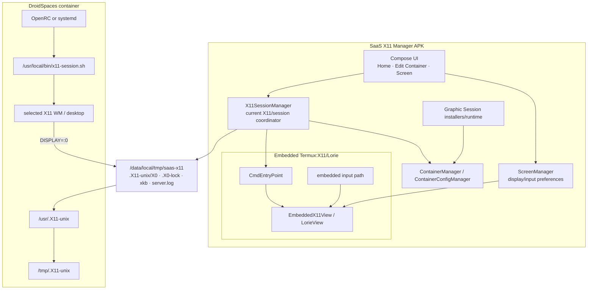

# SaaS X11 Manager

<p align="center">
  <strong>A rooted Android control plane for DroidSpaces graphical sessions with an embedded Termux:X11/Lorie renderer owned by the Manager itself.</strong>
</p>

<p align="center">
  <a href="https://github.com/SaaSD3v/SaaS-X11-Manager/actions/workflows/ci.yml"></a>
</p>

> [!IMPORTANT]
> **Active development branch documented here: `agent/screen-manager`.**
>
> This branch is the current Manager-owned Screen architecture: the X11 server and Lorie renderer are embedded in the SaaS X11 Manager APK. It is still a **single-display `:0` implementation**. Multi-monitor support is a future evolution, not current behavior on this branch.

SaaS X11 Manager manages DroidSpaces containers, graphical-session provisioning and an integrated X11 display from one Android application. Instead of handing rendering to a separately launched Termux:X11 Activity, the Manager builds the pinned Termux:X11/Lorie source into its own build graph, starts `CmdEntryPoint` from its installed APK, embeds the renderer in its own UI, and exposes the Manager-owned X11 socket to DroidSpaces containers.

The project follows two architectural rules:

> **Detect capabilities at runtime. Do not select behavior from a hardcoded DroidSpaces version, kernel version, distro release or package version.**

> **Keep responsibilities explicit. Container lifecycle, X11 server lifecycle, graphical sessions, the embedded renderer and UI should not slowly collapse into one giant manager class.**

---

## Project status

This branch combines several generations of work that previously existed separately: structural container/runtime fixes, graphical-session provisioning, the integrated X11 spike and the first project-owned Screen UI.

The important point is that the source is **ahead of the old README**. In particular:

- the Manager already embeds Termux:X11/Lorie in its own build;
- the Manager starts the integrated X server from its own APK classpath;
- the Manager renders `LorieView` inside its own Android UI;
- the external Termux:X11 Activity is not the normal Screen UI;
- `ScreenManager` owns persisted display/input configuration;
- `X11SessionManager` owns the current single-display X11 process/socket/XKB/session lifecycle;
- the graphical-session catalog is much larger than the original Openbox-only documentation;
- OpenRC and systemd remain independent runtime backends;
- package-platform behavior is capability-driven instead of version-driven.

The next phase should be **consolidation and cleanup before another large feature layer**.

| Area | Current branch | Direction |
| --- | --- | --- |
| DroidSpaces lifecycle | Capability-driven runtime integration | Isolate behind focused container/runtime APIs |
| X11 server | Manager-owned integrated `:0` server | Extract server lifecycle from the larger coordinator |
| Screen | Manager-owned embedded Lorie surface | Keep rendering/input isolated from container policy |
| Display configuration | `ScreenManager` + Screen UI | Keep UI preferences separate from X11 process lifecycle |
| Graphic sessions | Broad catalog, install/verify/runtime infrastructure | Reduce duplicated legacy/generic paths |
| Init systems | OpenRC + systemd | Move toward explicit interchangeable backends |
| Multi-monitor | Not implemented on this branch | Add only after the single-display boundaries are clean |
| Android VirtualDisplay / scrcpy | Not part of current Screen model | Future independent layer; do not conflate with X11 display numbers |

A green CI validates compilation and automated tests. It does **not** replace real-device validation of root access, DroidSpaces lifecycle, Android input, Binder/Lorie connection or graphical-session behavior.

---

## Contents

- [What the Manager owns](#what-the-manager-owns)
- [Architecture today](#architecture-today)
- [Integrated X11 runtime](#integrated-x11-runtime)
- [Starting X11](#starting-x11)
- [The Screen workspace](#the-screen-workspace)
- [Display and input configuration](#display-and-input-configuration)
- [Fullscreen](#fullscreen)
- [DroidSpaces integration](#droidspaces-integration)
- [Rootfs access and XKB](#rootfs-access-and-xkb)
- [Per-container metadata](#per-container-metadata)
- [Graphic Session model](#graphic-session-model)
- [Graphic Session installation](#graphic-session-installation)
- [Init backends](#init-backends)
- [Capability-driven policy](#capability-driven-policy)
- [Architecture cleanup plan](#architecture-cleanup-plan)
- [Future multi-monitor direction](#future-multi-monitor-direction)
- [Repository layout](#repository-layout)
- [Requirements](#requirements)
- [Build from source](#build-from-source)
- [CI and validation](#ci-and-validation)
- [Troubleshooting](#troubleshooting)
- [Known limitations](#known-limitations)
- [Embedded Termux:X11 source](#embedded-termuxx11-source)
- [Licensing](#licensing)
- [Development discipline](#development-discipline)

---

## What the Manager owns

The Android application currently owns:

- root-assisted DroidSpaces control;
- container discovery and runtime-state resolution;
- integrated X11 server lifecycle for `:0`;
- XKB staging for the embedded X server;
- the X11 socket exposed to containers;
- embedded `LorieView` rendering inside the Manager UI;
- mouse/touch/keyboard handling implemented by the embedded Screen path;
- display resolution/filtering/stretch preferences;
- clipboard preference forwarding to Lorie;
- touch-mode selection;
- keep-screen-awake behavior;
- optional additional keyboard controls;
- per-container init-system selection;
- graphical-session install/verify/select/reinstall workflows;
- OpenRC/systemd X11 startup provisioning;
- operation logs and runtime diagnostics.

The standalone Termux:X11 application is **not** the owner of the Screen lifecycle in this branch.

---

## Architecture today

The code is already conceptually divided, even though some objects still own too much behavior:



The current architecture has two distinct connections:

1. **Android renderer connection** — the embedded Lorie surface connects to the Manager-owned X server.
2. **Container X11 connection** — DroidSpaces exposes the Manager-owned X11 socket inside the Linux container so the selected graphical session can connect to `DISPLAY=:0`.

These are different concerns and should remain different concerns during the cleanup.

---

## Integrated X11 runtime

This branch is intentionally still single-display.

The current contract in `Constants.kt` is:

| Item | Value |
| --- | --- |
| X11 display | `:0` |
| Server process | `saas-x11` |
| Runtime directory | `/data/local/tmp/saas-x11` |
| Socket directory | `/data/local/tmp/saas-x11/.X11-unix` |
| Socket | `/data/local/tmp/saas-x11/.X11-unix/X0` |
| Lock | `/data/local/tmp/saas-x11/.X0-lock` |
| XKB cache | `/data/local/tmp/saas-x11/xkb` |
| Server log | `/data/local/tmp/saas-x11/server.log` |

The Manager starts the X server from its own installed APK using Android `app_process`:

```sh
TMPDIR=/data/local/tmp/saas-x11 \
XKB_CONFIG_ROOT=/data/local/tmp/saas-x11/xkb \
CLASSPATH=<installed-manager-apk> \
/system/bin/app_process -Xnoimage-dex2oat / \
  --nice-name=saas-x11 \
  com.termux.x11.CmdEntryPoint :0
```

The real command redirects output to `server.log`.

### Health model

A process alone is not sufficient proof that X11 is healthy, and a socket alone is not sufficient either.

The runtime treats the server as usable when it has both:

- a live Manager-owned `saas-x11` process;
- a real X11 `X0` socket.

Stale process/socket state is cleaned before a fresh start. A newly created server can also be rolled back when a later session-start stage fails.

---

## Starting X11

There are two related flows in the app.

### Starting only the integrated server from Screen

The Screen page can start the Manager-owned X server directly:

```text
ScreenManager
    ↓
apply display/Lorie preferences
    ↓
X11SessionManager.startIntegratedServer()
    ↓
prepare runtime + XKB
    ↓
launch CmdEntryPoint :0
    ↓
wait for process + X0 socket
    ↓
EmbeddedX11View connects
```

This is useful because the Screen is a first-class Manager surface instead of a side effect of opening another application.

### Starting a container graphical session

The full container flow coordinates host X11 with DroidSpaces lifecycle:

```text
prepare container X11 config
        ↓
start/reuse integrated :0 server
        ↓
start/reuse DroidSpaces container
        ↓
confirm runtime state
        ↓
wait until `droidspaces run` actually works
        ↓
OpenRC/systemd starts x11-session.sh
        ↓
selected graphical session connects to DISPLAY=:0
        ↓
render through the Manager Screen
```

A container PID alone is not treated as proof that userspace is ready; the project waits for a real container command channel before continuing with operations that require it.

---

## The Screen workspace

`IntegratedScreenScreen` is the project-owned Screen UI.

It deliberately separates **display presentation** from **X11 runtime controls**.

The Screen includes:

- an embedded X11 viewport;
- current X11 server status;
- current server PID;
- selected seed/container context where required;
- Start/Stop X11 controls;
- display configuration;
- input configuration;
- fullscreen mode;
- optional additional keyboard controls.

The embedded surface is hosted by the Manager. It is not the upstream Termux:X11 MainActivity presented as a separate app window.

---

## Display and input configuration

`ScreenManager` persists only the settings owned by this Screen architecture and forwards the subset consumed by Lorie.

Current display settings include:

- resolution mode: Native, Scaled, Exact or Custom;
- scaling percentage;
- predefined exact resolutions;
- custom resolution;
- Nearest or Bilinear filtering;
- adjust-resolution preference;
- stretch display;
- clipboard synchronization;
- keep-screen-awake behavior.

Current touch modes are:

| Mode | Wire value |
| --- | ---: |
| Trackpad | `1` |
| Simulated touch | `2` |
| Direct touch | `3` |

The current exact-resolution catalog includes common sizes from `800x600` through `3840x2160`.

`ScreenManager` intentionally avoids treating old standalone-Lorie Activity preferences as Manager-owned features. For example, stale standalone keys such as old fullscreen/orientation/cutout preferences are removed from the Manager preference store instead of pretending that the upstream Activity still controls the UI.

---

## Fullscreen

Fullscreen on this branch is an immersive presentation of the **same embedded renderer**.

It is not a transition into the upstream Termux:X11 Activity.

The current implementation still contains its own fullscreen dialog/chrome. One of the cleanup goals is to make fullscreen input-safe: controls must not permanently occupy areas that should belong to the X11 surface, and exiting fullscreen should be possible without creating invisible click-blocking regions over the desktop.

This is an area that must be validated on-device because Compose layout, Android window insets and the embedded SurfaceView all meet at the same boundary.

---

## DroidSpaces integration

The current filesystem contract is:

```text
/data/local/Droidspaces
```

with the CLI at:

```text
/data/local/Droidspaces/bin/droidspaces
```

This is a path contract in the current code, **not** a declaration that one DroidSpaces version or one kernel version is required.

### Manager-owned X11 socket

The Manager does not rely on DroidSpaces' automatic Termux:X11 lifecycle for this integrated path.

The container configuration uses:

```ini
enable_termux_x11=0
```

and exposes the Manager-owned socket directory to:

```text
/usr/.X11-unix
```

Unrelated container configuration and unrelated bind mounts should be preserved.

---

## Rootfs access and XKB

DroidSpaces root filesystems are not assumed to always be unpacked directories.

The shared rootfs accessor supports operation-owned access to representations such as:

- normal directories;
- filesystem images;
- block-backed root filesystems.

Temporary mounts belong to the operation that created them and should be cleaned without pre-emptively unmounting unrelated mounts.

### XKB bootstrap

The embedded server needs keyboard configuration data.

Before the first successful integrated X11 start, the Manager can stage XKB from a configured container rootfs, looking for paths such as:

```text
/usr/share/X11/xkb
```

with an alternate xkeyboard-config path when present.

The staged data is cached under:

```text
/data/local/tmp/saas-x11/xkb
```

and reused on later starts.

---

## Per-container metadata

Manager-owned metadata is kept outside the DroidSpaces `container.config` format in:

```text
.saas-x11-manager.conf
```

Typical fields include:

```ini
platform=alpine
init_system=openrc
graphic_session=openbox
installed_openbox=1
```

The important semantic distinction is:

```text
installed ≠ selected
```

A session can remain installed while another session becomes the selected default.

User selections are the source of truth. Capability/distro detection may help resolve what is possible, but it should not silently overwrite a persisted manual choice.

---

## Graphic Session model

A **Graphic Session** is the X11 client environment started inside a DroidSpaces container. It can be a lightweight window manager or a complete desktop session.

The project separates:

```text
package platform
        ↓
init backend
        ↓
graphic-session package/install plan
        ↓
session-specific setup/verification
        ↓
generic x11-session.sh startup
```

The source now contains a broad session catalog and support-spec layer; it is no longer accurate to describe the branch as Openbox-only.

Examples represented in the current support infrastructure include Openbox, IceWM, JWM, Fluxbox, cwm, i3, AwesomeWM, Ratpoison, Window Maker, dwm, bspwm, Qtile, XMonad, XFWM4, KWin X11, Enlightenment, MATE, LXDE, Plasma X11, Cinnamon, GNOME/Xorg-style paths and many additional window managers.

**Catalog presence is not the same as universal compatibility.** A usable workflow still depends on the package plan, repositories, executable/session artifacts and capabilities available in the selected rootfs.

Openbox remains an important reference implementation because it established several project rules: minimal packages, non-destructive configuration preservation, separate install/verify behavior and generic init provisioning.

---

## Graphic Session installation

The project currently contains both older/reference installer paths and newer generic session infrastructure.

That history is useful, but it is also one of the reasons the source now needs consolidation.

The intended generic workflow is:

```text
resolve package platform by capability
        ↓
resolve supported Graphic Session plan
        ↓
start stopped container temporarily when required
        ↓
run the real package transaction
        ↓
perform only necessary session-specific setup
        ↓
validate required executables/configuration
        ↓
provision selected init backend
        ↓
persist platform/init/session state
        ↓
restore original stopped state when appropriate
```

Installation and verification are different operations.

### Install / Reinstall

May mutate package state and create required session-specific files.

### Verify

Should inspect the existing installation and startup contract without quietly turning itself into a reinstall.

### Package-manager policy

The architecture should avoid redundant standalone package simulations when the real `apk` or `apt` transaction is about to resolve repositories and dependencies anyway. Compatibility checks belong where they add real safety or clear error reporting, not as duplicated work for its own sake.

---

## Init backends

Init system and package platform are independent.

The Manager supports two startup families.

### OpenRC

Typical generated files:

```text
/etc/init.d/x11-setup
/etc/init.d/x11-session
/usr/local/bin/x11-session.sh
```

`x11-setup` prepares the socket path and `x11-session` launches the selected graphical-session command.

### systemd

Typical generated files:

```text
/etc/systemd/system/setup-x11-socket.service
/etc/systemd/system/x11-session.service
/usr/local/bin/x11-session.sh
```

The setup unit prepares the socket path and the session service launches the same generic session entry point.

A package family must not silently force an init system just because that pairing is common on a conventional distro installation.

---

## Capability-driven policy

The Manager should answer questions from what the current environment can actually do.

Examples:

- package platform: detect `apk` or `apt-get` + `dpkg`;
- init backend: detect the relevant OpenRC/systemd capabilities;
- runtime state: use the DroidSpaces mechanisms that are actually available and confidently parseable;
- rootfs: handle the representation the container really uses;
- session availability: intersect package plan, support spec and repository/runtime capabilities.

`/etc/os-release` can provide context, but it should not become a global switch such as “if distro version X then do Y”.

The same applies to Android/kernel/DroidSpaces versions: test capabilities and behavior rather than freezing logic around one test device.

---

## Architecture cleanup plan

The project has reached the point where adding features without cleaning boundaries will make every later change more expensive.

The cleanup should be incremental and behavior-preserving.

### 1. Freeze the current single-display behavior

Before moving files around, keep tests around the existing `:0` contract:

- process name;
- socket health;
- stale cleanup;
- XKB bootstrap;
- container bind preparation;
- Start X11 rollback;
- Screen connection behavior.

### 2. Split `X11SessionManager`

Today it still owns too much. The target responsibilities are closer to:

```text
X11ServerManager
  process / socket / runtime / PID / cleanup

ContainerX11Bridge
  DroidSpaces bind/config preparation

GraphicSessionController
  start/stop selected session inside an already-running container

XkbRepository
  shared XKB bootstrap/cache

X11SessionCoordinator
  orchestration only
```

This does not require turning every class into a Gradle module immediately.

### 3. Isolate DroidSpaces integration

Compose/ViewModels should not construct shell commands or understand container config syntax.

The target direction is:

```text
UI
 ↓
ViewModel / use case
 ↓
container + X11 domain API
 ↓
DroidSpaces/shell implementation
```

### 4. Consolidate Graphic Session installers

The project should end with one coherent install/verify/runtime contract and only small session-specific definitions where required.

Do not keep two full installer frameworks forever simply because both once worked.

### 5. Make OpenRC/systemd explicit backends

Instead of spreading `systemctl`/`rc-service` policy across unrelated code, hide them behind one startup contract with two implementations.

### 6. Keep Lorie behind an embedded boundary

The rest of the app should depend on a small Manager-owned renderer/input interface, not on scattered `com.termux.x11.*` implementation details.

This reduces the blast radius when the pinned upstream Termux:X11 source changes.

### 7. Simplify Screen UI responsibilities

The Screen should render state and send user intent. It should not become the place that decides how to kill processes, mount rootfs images, choose package managers or rewrite DroidSpaces configuration.

### 8. Remove dead/duplicate paths only after replacement is proven

Delete obsolete helpers, old Loader assumptions, duplicated session logic, unreachable screens and stale documentation only after the replacement path is covered and validated.

---

## Future multi-monitor direction

Multi-monitor is a **planned evolution from this branch**, not something the current branch already provides.

The desired future model is:

```text
Monitor 1 -> X11 :0
Monitor 2 -> X11 :1
Monitor 3 -> X11 :2
...
```

Container assignment should be a temporary runtime lease, not a permanent historical property.

Example policy:

```text
A uses Monitor 1 (:0)
B uses Monitor 2 (:1)
C uses Monitor 3 (:2)

B disconnects and releases :1

D starts next
D receives Monitor 2 (:1)
```

The allocator should therefore choose the **lowest currently free X11 display number**.

A container that previously used another monitor should not automatically return there unless there is a separate explicit reservation feature in the future.

### X11 monitor number is not Android displayId

Future work involving Android `VirtualDisplay`, scrcpy or Android `DisplayManager` must stay architecturally separate.

```text
X11 DISPLAY=:2
```

and

```text
Android displayId=2
```

are different namespaces with different lifecycles. They must not be treated as equivalent just because both happen to use integers.

---

## Repository layout

The current branch is roughly organized as:

```text
.
├── app/
│   ├── Android UI / ViewModels
│   └── util/
│       ├── DroidSpaces/container integration
│       ├── X11SessionManager
│       ├── ScreenManager
│       ├── Graphic Session catalog/install/runtime
│       └── rootfs/capability helpers
│
├── third_party/termux-x11/
│   └── pinned Termux:X11 source submodule
│
├── shell-loader/
│   └── compile-time stub bridge required by the Lorie build graph
│
├── ci/
│   └── package/session compatibility tooling
│
└── .github/workflows/
    ├── ci.yml
    └── rootfs-compatibility.yml
```

Important current source-of-truth files include:

| Concern | Source |
| --- | --- |
| X11 process/socket/XKB lifecycle | `X11SessionManager.kt` |
| X11 runtime constants | `Constants.kt` |
| Screen configuration | `ScreenManager.kt` |
| Embedded Screen UI | `IntegratedScreenScreen.kt` |
| Embedded Lorie view/input bridge | `EmbeddedX11View.kt` |
| Container config mutation | `ContainerConfigManager.kt` |
| Container lifecycle/state | `ContainerManager.kt` |
| Rootfs access | `RootfsAccessor.kt` |
| Capability detection | `ContainerCapabilities.kt` |
| Per-container Manager metadata | `ContainerSettingsManager.kt` |
| Graphic Session support specs | `GraphicSessionSupport.kt` |
| Generic/extended installs | `AdditionalGraphicSessionInstaller.kt` |
| Extended session runtime | `AdditionalGraphicSessionRuntime.kt` |

The cleanup plan above is expected to change this layout gradually.

---

## Requirements

Runtime requirements for this branch are:

- Android device able to grant the Manager a working root shell;
- DroidSpaces available through the current filesystem integration contract;
- at least one configured DroidSpaces container for container-specific work and first XKB bootstrap;
- a rootfs with the package/init/session capabilities required by the graphical session being installed or started.

A separately launched Termux:X11 Activity is **not** the Manager Screen requirement in this branch.

The Termux:X11/Lorie source is part of the project build through the pinned git submodule.

No fixed DroidSpaces, kernel, distro or package version should be treated as the architectural requirement unless a concrete capability truly cannot be expressed any other way.

---

## Build from source

### Toolchain

The Android app currently uses:

- Android Gradle Plugin / Gradle project configuration from the repository;
- Kotlin + Jetpack Compose;
- Java 17;
- app `compileSdk` / `targetSdk` 34;
- app `minSdk` 26;
- libsu for root execution.

These are project build settings, not DroidSpaces/kernel compatibility declarations.

### Clone with submodules

The embedded X11 engine is pinned as a git submodule:

```sh
git clone --recurse-submodules <repository-url>
cd SaaS-X11-Manager
```

For an existing clone:

```sh
git submodule update --init --recursive
```

### Build

Debug:

```sh
./gradlew assembleDebug
```

Release tests + release APK:

```sh
./gradlew testReleaseUnitTest assembleRelease
```

Release APK only:

```sh
./gradlew assembleRelease
```

---

## CI and validation

The Android CI is configured to run on pushes to `agent/screen-manager`.

Its responsibilities include initializing the integrated Termux:X11 source, validating expected upstream source files and running the project's automated test/build pipeline.

The rootfs compatibility workflow is a separate concern and uses path filters around package/session compatibility infrastructure. A README-only change should not be interpreted as rootfs validation.

Keep these concepts separate:

```text
CI green
  = source compiles + automated tests pass

real device validation
  = Android root + DroidSpaces + X11 process + Binder/Lorie + input + real session proven together
```

A build cannot prove vendor-specific touchpad/stylus behavior or every Linux desktop package combination.

---

## Troubleshooting

### X11 server does not start

Inspect:

```text
/data/local/tmp/saas-x11/server.log
```

Then verify that both exist conceptually:

```text
live saas-x11 process
/data/local/tmp/saas-x11/.X11-unix/X0
```

A process without the socket or a socket without the process is stale/incomplete state.

### First X11 start fails before the server is ready

Check whether XKB was successfully staged from a configured container rootfs.

Expected cached destination:

```text
/data/local/tmp/saas-x11/xkb
```

### Screen is open but not connected

This can be different from a container/session problem. The X11 process/socket can be alive while the embedded Lorie surface has not completed its connection.

Inspect the Android-side embedded view/Binder path separately from the Linux X client path.

### Screen is connected but black

A connected renderer does not guarantee that an X11 client is drawing.

Check:

- is the intended DroidSpaces container actually running?
- is the Manager X11 bind present in the container config?
- does the container see the X11 socket path?
- is the selected OpenRC/systemd session service active?
- does `x11-session.sh` execute the selected session command?
- is `DISPLAY=:0` present in the current single-display branch?

### A Graphic Session is not usable

Do not assume that being listed in the catalog guarantees that the selected rootfs repository still contains every expected package/session artifact.

Inspect the current package plan, support spec, repository availability and executable/session probes.

---

## Known limitations

Current limitations and constraints include:

- root access is required;
- current DroidSpaces paths are fixed by the integration code;
- this branch currently owns only X11 display `:0`;
- multi-monitor is not yet implemented here;
- the embedded Screen/input path still needs device-specific validation across Android vendors;
- first server bootstrap depends on obtaining usable XKB data when no cache exists;
- graphical-session packages and X11 artifacts can change as distro repositories evolve;
- catalog presence is not universal runtime proof;
- the project intentionally avoids adding a second local X server or display manager unless a specific architecture change requires it;
- CI cannot prove every real-device root/input/renderer combination;
- some classes still own too many responsibilities and are explicitly scheduled for cleanup.

---

## Embedded Termux:X11 source

The project pins upstream Termux:X11 under:

```text
third_party/termux-x11
```

and includes the Lorie module in the Gradle graph.

The build also includes the required shell-loader stub namespace for compile-time compatibility, but the Manager's Screen architecture is not based on launching an external shell-loader UI.

When updating the pinned upstream source:

1. update the git submodule deliberately;
2. inspect Lorie/CmdEntryPoint/AIDL/input changes;
3. run the full Android test/build pipeline;
4. test real-device server startup and Screen connection;
5. test mouse/touch/keyboard/fullscreen behavior;
6. test at least one real graphical session;
7. keep Manager-specific adaptation as isolated as possible.

Do not make upstream changes invisible by scattering workarounds throughout unrelated app code.

---

## Licensing

There is currently **no top-level project `LICENSE` file on this branch**.

The embedded third-party Termux:X11 source carries its own license and is compiled into the Manager build. Therefore the old README's one-line `MIT` declaration should not be treated as a reliable project-wide license statement.

Before distributing releases as a product, define the repository's own license deliberately and review the license/source-compliance requirements of all bundled third-party code.

---

## Development discipline

The project should continue to move through small, validated changes:

```text
inspect current branch and real source
        ↓
one focused logical change
        ↓
one commit
        ↓
unit tests + release build
        ↓
real-device validation where CI cannot prove behavior
        ↓
next change
```

Rules for the cleanup phase:

- do not mix architecture refactors with unrelated features in one commit;
- do not continue to the next refactor while the previous logical change is failing CI;
- preserve current single-display behavior while extracting responsibilities;
- do not infer behavior from fixed DroidSpaces/kernel/distro versions;
- do not overwrite unrelated container/user configuration;
- keep installed and selected Graphic Session state independent;
- preserve stopped container state when an operation only needs a temporary runtime start;
- keep embedded Termux:X11 details behind a narrow boundary;
- treat multi-monitor as a later feature built on the cleaned single-display foundation;
- document uncertainty instead of calling device-only behavior proven because it compiled.

---

**SaaS X11 Manager is an integration project.** Android UI, root execution, DroidSpaces, an embedded X11 server, an embedded renderer and Linux graphical-session provisioning all meet at the same boundary. The project becomes maintainable when those pieces are explicit and independently testable instead of accumulating inside one large flow.
